# A summary of the Arcadia model-based systems engineering method

This work presents a summarized view of the Arcadia model-based systems engineering method as described in “Model Based System and Architecture Engineering with Arcadia” by Voirin (ISBN: 978-1-78548-169-7). The aim of this summary is to provide a shortened, simplified and easy to follow bullet-pointed task and information list about the method and the ideas behind it, since the aforementioned book is almost entirely written in prose, which makes it hard to use as a reference in a day-to-day working environment.

It is important to note, that even everything combined, the overall extent of this summary is less than a tenth of what is described in the book, so it is by no means meant to be a replacement for that. Full understanding of the concepts and method presented in this summary is only possible by reading the book as well.

> __Disclaimer:__
>Even though I tried to rephrase most of the content for easier out-of-context understanding, there are numerous cases where the text is taken from the book as is, because it was already easy enough to comprehend in a bullet-pointed format as well. No copyright infringement was intended at any part, and I do not own any rights of this method or book content.

>__Disclaimer 2:__
>It may very well be possible that I made mistakes while trying to extract the most essential information about the method and ideas, so this summary might not conform 100% to what was originally intended by the author of the book this summary is based on. In such cases, please feel free to submit pull requests to correct such mistakes.
>If you have some other types of additions/ideas, which would make this summary easier to use in a working environment, I’d most definitely like to hear about them as well.

>__Special note:__
>A small amount of information was also taken from “System Architecture Modeling with the Arcadia Method” by Roques (ISBN: 978-1-78548-168-0) to further ease understanding.  
>The images found throughout this summary are directly taken from the zip files freely made available by the publisher (ISTE press):  
>http://www.iste.co.uk/voirin/arcadia.zip  
>http://www.iste.co.uk/roques/arcadia.zip

## Table of contents

[1. The Arcadia model in a nutshell](#1-the-arcadia-model-in-a-nutshell)  
- [1.1. Model structure](#11-model-structure)  
- [1.2. Most important concepts of the model](#12-most-important-concepts-of-the-model)  
- [1.3. Diagram types of the model](#13-diagram-types-of-the-model)

[2. Bulding the different model perspectives](#2-bulding-the-different-model-perspectives)  
- [2.0. Functional analysis (FA)](#20-functional-analysis-fa)
- [2.1. Operational analysis (OA)](#21-operational-analysis-oa)  
- [2.2. System needs analysis (SA)](#22-system-needs-analysis-sa)  
- [2.3. Definition of principle (logical) architecture (LA)](#23-definition-of-principle-logical-architecture-la)  
- [2.4. Definition of finalized (physical) architecture (PA)](#24-definition-of-finalized-physical-architecture-pa)  
- [2.5. Definition of product building strategy (PB)](#25-definition-of-product-building-strategy-pb)  

[3. Applying the Arcadia method](#3-applying-the-arcadia-method)  
- [3.1. Mixing viewpoints](#31-mixing-viewpoints)  
- [3.2. Requirements engineering and modeling](#32-requirements-engineering-and-modeling)  
- [3.3. Integration, Verification and Validation (IVV) approach](#33-integration-verification-and-validation-ivv-approach)  
- [3.4. Articulation between engineering levels](#34-articulation-between-engineering-levels)  
- [3.5. Model-based articulation](#35-model-based-articulation)  
- [3.6. System supervision, states and modes](#36-system-supervision-states-and-modes)  

## 1. The Arcadia model in a nutshell

### 1.1. Model structure
- Each model is built up from several submodels (perspectives):
    - Operational analysis (OA) _(lowest level)_
    - System needs analysis (SA)
    - Logical architecture (LA)
    - Physical architecture (PA)
    - Product building strategy (PB) _(highest level)_
- Each submodel is built on the previous one by linking model elements of a higher level submodel to the elements of a lower level submodel with traceability/justification links
- Traceability links always point downwards in the hierarchy: PB --> PA --> LA --> SA --> OA
- Each submodel is built up from different functional and structural viewpoints:
    - _Data and interfaces_ description
    - _Functional_ description
    - _Behavioral_ structural description
    - Structural description of hosting _resources_
- Each description is linked to the other descriptions by allocation, performance, implementation links
- Description dependencies always point downwards: Resources --> Behavior --> Functional --> Data & interfaces
- Each view is built up from subelements
    - Structural description: tree of components
    - Data model: graphs of data, exchange items and interfaces
    - Functional description: missions and capabilities  
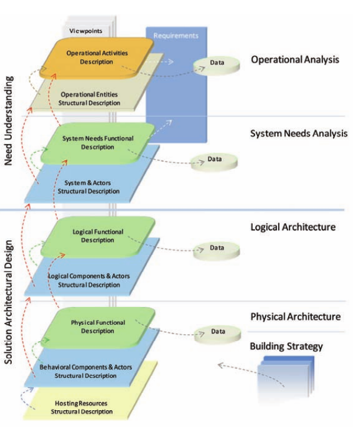

### 1.2. Most important concepts of the model

#### Functional and operational description concepts
- __System mission:__ high level goal to which the system should contribute
- __System capability:__ system’s expected ability to supply a service contributing to fulfill one or more missions
- __Functional chain:__  an ordered set of references to functions and the exchanges that link them
- __Function scenario:__ time-ordered dynamic flow of exchanges between different functions
- __Functional exchange:__ a possible interaction between a source a destination function
- __Exchange item:__ data to be conveyed
- __Function:__ an action, operation or service performed by an actor, the system or one of its components
- __Function port:__ an interface through which a function communicates with other functions of its environment
- __Flow control functions:__
    - __Duplicate function:__ route the same exchange item from one source to many targets
    - __Split function:__ route an exchange item selectively from one source to many targets
    - __Route function:__ route some exchange items (possibly based on conditions) from many sources to many targets
    - __Gather function:__ combine several exchange items from many sources to one target
    - __Select function:__ route exchange item from one selected source of many to (possibly) many targets
- __Orchestration:__ specifies a complete system usage context at a given instant
- __Operational activity:__ an action, operation or service realized by an operational entity likely to influence the system definition or usage
- __Operational mission:__ a high-level goal to which one or more operational entities should contribute
- __Operational capability:__ an ability expected of one or more operational entities to provide a service fulfilling one or more operational missions
- __Operational process:__ an ordered set of references to operational activities and the interactions between them, which implements a capability
- __Operational activity scenario:__ a time-ordered dynamic flow of interactions between different operational activities

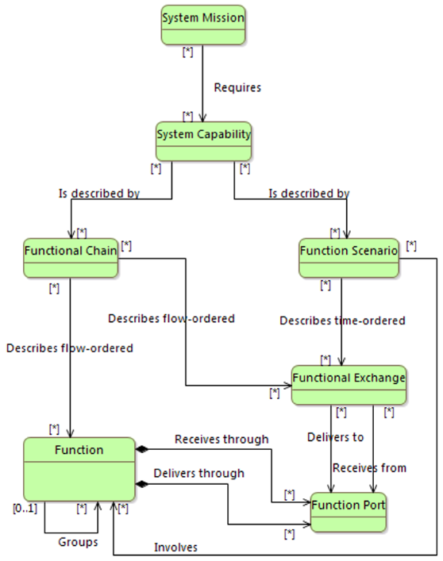
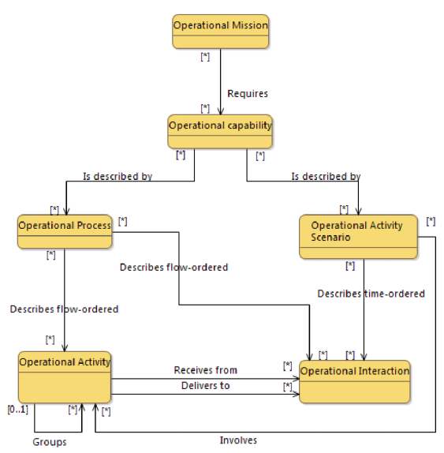

#### State and modes concepts
- __Mode:__ a behavior expected of the system, component, actor or operational entity under chosen conditions
- __State:__ a behavior of the system, component, actor or operational entity under imposed (external) conditions
- __Transition:__ a change from one mode/state to another triggered by some event
- __Mode/state machine:__ a set of modes/states linked to one another by transitions
- __Configuration:__ a set of model items that are globally available/unavailable in a given context (i.e. active mode/state)
- __Situation:__ a combination of states and modes linked by Boolean operators representing the superposition of states and modes

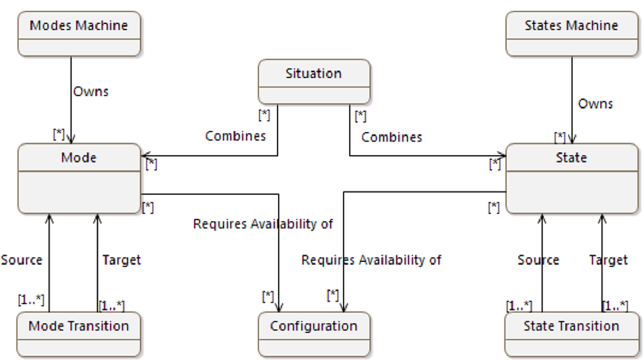

#### Structural description concepts
- __System:__ an ordered set of elements responding to customer/user needs, functioning as a whole
- __Actor:__ an entity external to the system, which also interacts with it
- __Component:__ a part of the system contributing to its behavior and/or properties
- __Behavioral component:__ a system component responsible for carrying out some functions of the system
- __Behavioral port:__ an interface between different behavioral components
- __Behavioral exchange:__ a possible interaction between source and destination behavioral components transmitting exchange items
- __Logical component:__ a system component described at a conceptual level
- __Hosting physical component:__ a component providing resources for a number of hosted behavioral components
- __Physical port:__ a hosting physical component’s interface with its environment
- __Physical link:__ a means of communication or transport between two hosting physical components
- __Physical path:__ an ordered set of references to physical links defining a continuous path
- __Behavioral component scenario:__ a time-ordered dynamic flow of exchanges between behavioral components
- __Operational entity:__ a real-world entity carrying out operational activities to which the system will contribute
- __Operational actor:__ a type of operational entity which cannot be broken down
- __Configuration item:__ a system part to be acquired, designed and produced

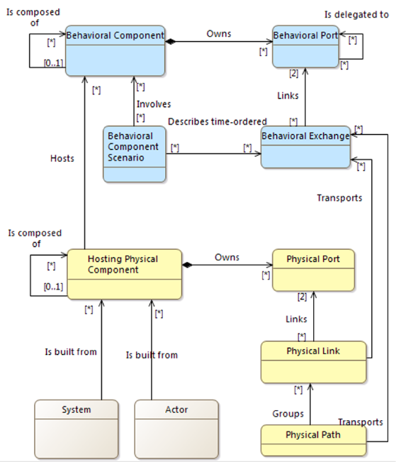

#### Data exchange concepts
- __Exchange item:__ an instance of the data type routed by functional or behavioral exchanges
- __Data:__ an element produced or used by functions or components
- __Class:__ an ordered set of data defined by name, list of named properties and potential relationships with other classes
- __Interface:__ a set of semantically coherent exchange items allowing two components to communicate
- __Interaction role:__ expresses the way in which an interface is used by a component by allocating the interface to a component’s behavioral ports
- __Interaction protocol:__ a dynamic description of the implementation of one interface in one interaction between several components

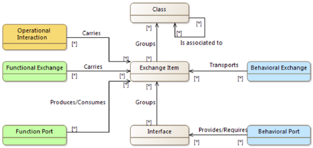

#### Links between concepts of different perspectives
- __Functional and structural__

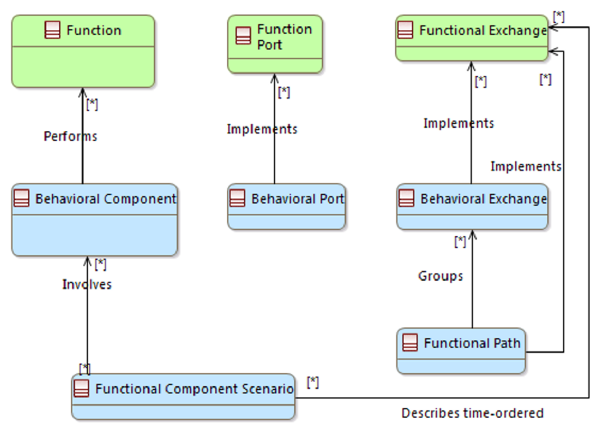

- __States/modes and fucntional and structural__

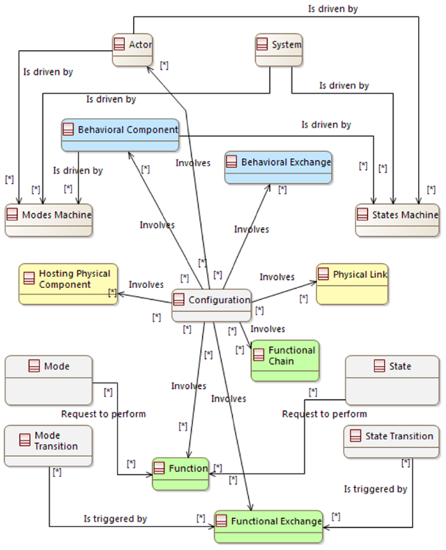

### 1.3. Diagram types of the model

#### Diagram color conventions
| Element | Color |
|--------|-------|
| function | green |
| function ports | green (out) or red (in) |
| behavioral components | blue |
| behavioral component ports | white |
| hosting physical components | yellow |
| hosting phys. component ports	| yellow |
| states and modes | gray |
| exchange items | gray |
| interfaces | gray |

#### Data flow diagram
- Represents: information dependency network between functions.

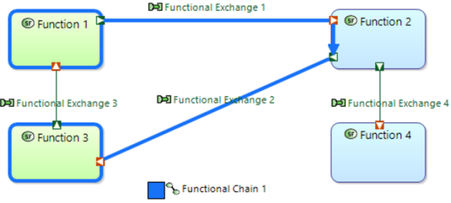

#### Architecture diagram
- Represents:
    - In LA: constitutive elements of the system: logical components
    - In PA: deployment of behavior components over node components providing resources
- Types:
    - Architecture diagram:
        - Represents: allocation of functions to components.
    - Functional chain:
        - Represents: system under study and the actors surrounding it

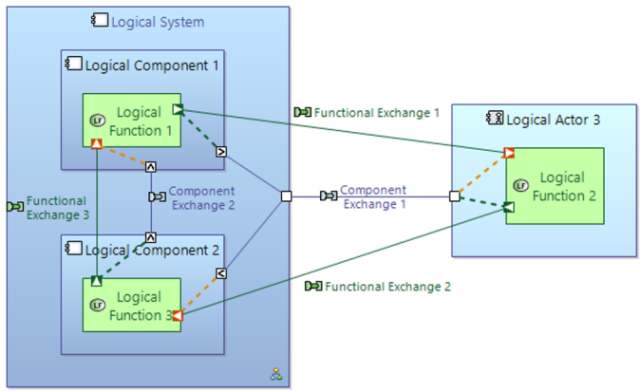

#### Scenario diagram
- Represents: vertical sequence of messages passed between elements
- Glossary:
    - _Lifeline:_ representation of a model element participating in the scenario
    - _Message:_ unidirectional communication item between lifelines, which triggers a behavior on the receiver side
- Types:
    - Functional scenarios:
        - _Lifelines_ are functions
    - Exchange scenarios:
        - _Lifelines_ are components/actors
        - _Messages_ are functional exchanges or component exchanges
    - Interface scenarios:
        - _Lifelines_ are components/actors
        - _Messages_ are exchange items

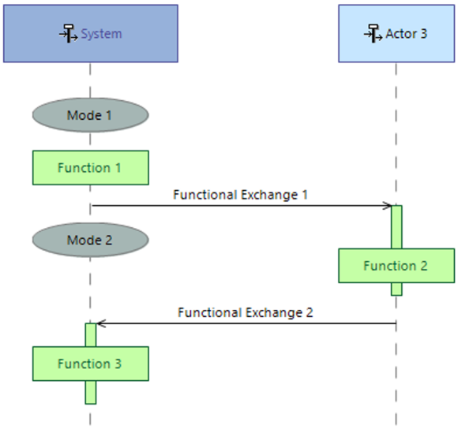

#### Mode and state diagram
- Represents: state/mode machines

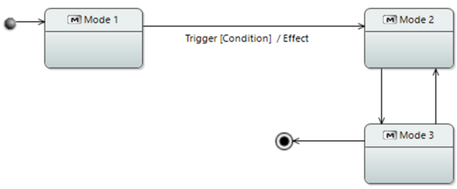

#### Breakdown diagram
- Represents: hierarchies of functions or components

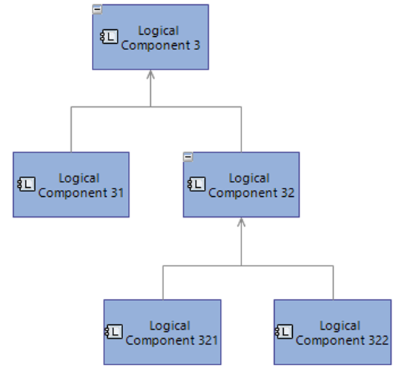

#### Class diagram
- Represents: component properties and relationships

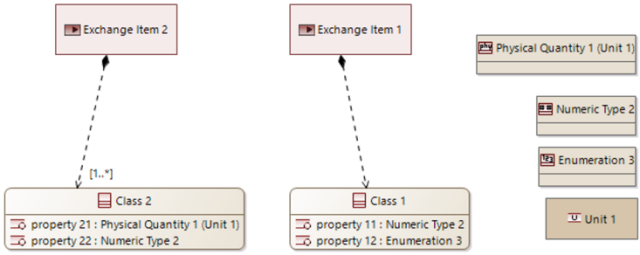

#### Capability diagram
- Represents: relationships between missions, capabilities and actors

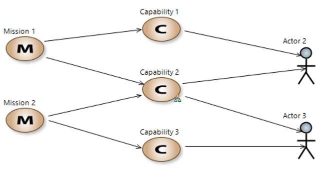

## 2. Bulding the different model perspectives

### 2.0. Functional analysis (FA)

#### Overview
Describes behaviors expected by users. Has 4 views:
- Functional dependency graphs (dataflow)
- missions, capabilities, functional chains, contextual scenarios
- modes and states governing system capabilities
- data model describing content of exchanges

#### Construction approaches
- __Top-down:__
    - Define a limited number of first-level functions and exchanges between them first, then define subfunctions and exchanges on as many levels down (recursively) as needed.
    - Exchange reallocation: move exchange from parent to the appropriate terminal or leaf functions
    - _End product:_ a functional hierarchy including above mentioned elements
    - _Use cases:_
        - Build specification starting with blank paper without preliminary requirements
        - Hierarchical decomposition of higher level functional exchanges
- __Bottom-up:__
    - Define a set of elementary (sub)functions and their exchanges first, then hide them by grouping them into higher level (parent) functions. Repeat for as many levels up as needed.
    - This is where textual requirements are converted into functions, exchanges and links between them
    - _End product:_ a functional hierarchy including above mentioned elements
    - _Use cases:_
        - When a FA is built from a set of requirements describing the need.
- __Functional construction/allocation:__
    - Define functional content of structural elements (system, components, operators, external actors, etc.) from a set of activities or services to be achieved.
    - _End product:_ a graph of gradually built functional dependencies
    - _Use cases:_
        - In OA and SA: identify the functions that the system, operators and external actors will have to perform for each operational activity
        - In LA and PA: define the behavior of system components based on functional needs. Identify functions and exchanges describing the contribution allocated to each system component, operator, external actor
        - Review of SA
- __Service functions and traversal functional chains:__
    - Identify use cases of system users and external actors (main interactions with the system) and the required functional services for each of them, namely the main interactions of users and actors with the system.
    - Define functional content and associated exchanges from items identified previously.
    - Structure use cases by system capabilities
    - Look for (traverse) other already identified functions to establish communication between them.
    - Define new functions, establish system-internal functional exchanges, do function extractions/decompositions if needed
    - _End product:_ gradually built graph of functional dependencies
    - _Use cases:_
        - Build specification starting with blank paper without preliminary requirements
        - Definition of testing and integration scenarios
        - Performance and safety engineering
- __Use case scenario based__
    - Identify key system use cases and operating situations by formalizing them in the form of time-ordered scenarios of interactions with users and actors
    - Identify the source and destination functions of each interaction within each scenario. This will also establish the functional exchanges.
    - Try to reuse functions and functional exchanges.
    - Complete functional description based on missing functions and exchanges to ensure global expected behavior
    - _End product:_ a graph of gradually built functional dependencies
    - _Use cases:_
        - As part of a capability analysis process
        - Definition of testing and integration scenarios
        - Performance and safety engineering
- __Practical approach__
    - A mixture of the previous ones, whichever suits a particular situation best.
    - Might be possible to start with top-down, then switch to bottom up when requirement changes are necessary
    - System states, modes, and data model are developed in parallel with previously mentioned methods. Data, state and mode appear as soon as functional exchanges, capabilities and scenarios appear, respectively.

### 2.1. Operational analysis (OA)

#### Overview
_"What the users of the system need to accomplish"_

A method to capture what system users must achieve as part of their work or mission, and the associated conditions regardless of solution or particularities of systems. In fact, it should never mention the system in order not to bar itself from alternatives. The goal of OA in simpler terms is: how to satisfy customer needs without an imposed system scope.

Customer requirements may be used as input for OA, just as interviews, user situation simulations, existing documents, available systems, etc.

The results of this analysis can serve as input for system verification, validation and qualification.

#### Main tasks to perform:
- Define missions and required operational capabilities
    - Determine future system’s and users’ missions (expectations, goals, objectives, intensions, etc) and capabilities (know-how) required to satisfy aforementioned missions.
    - Identify constraints on mission execution (actor skills, operating modes, rules, existing means and systems, regulatory constraints, temporal and programmatic aspects…)
    - Define quantitative and qualitative metrics to evaluate the conditions for mission success
- Perform operational needs analysis
    - Capture conditions for the completion of previously defined missions and capabilities (through activities and interactions of key players).
    - Formalize various situations (nominal, non-nominal and worst case) that shape and influence the missions in order to reveal constraints likely to have high impact, principles behind the implementation and opportunities for process development.
    - Identify non-functional and performance constraints of each mission context and elements to which they apply
    - Identify actors, organizations and operational entities and their required in-mission activities, interactions and exchanged information more accurately.
    - Use FA to develop the activities and their interactions
    - Capture different mission phases, operational contexts, encountered situations via operational statuses, modes and transitions.
    - Formalize captured situations in form of scenarios, which should specify conditions for the implementation of required capabilities and contributions each stakeholder (actor, activity, interaction, etc.) does.
    - Identify first non-functional and performance constraints (and corresponding elements) applying in the context of each mission, like human factors, feared security/safety events, time constrained operational processes, etc.
    - Define priorities, significance, and criticality levels for OA elements
    - Allocate metrics to analysis elements

### 2.2. System needs analysis (SA)

#### Overview
_"What the system needs to accomplish for the users"_

Defines the contribution expected of the system to the users’ needs (as described in OA) by delimiting the functions (and exchanges between them) required of the system. SA only captures functional needs and completely excludes implementation details and choice.

#### Main tasks to perform:
- Capability trade-off analysis
    - Define essential characteristics necessary to fulfill each operational capability (problem space)
    - Uncover different alternative orientation likely to satisfy required capabilities (solution space)
    - Compare orientations to find best compromise between desirable characteristics
    - Identify deviations between required operational capabilities and existing means, systems, resources
    - Define major parameters able to support or hinder effective implementation of each capability, like doctrines, procedures, human factors and skills, logistics, deployment conditions, hosting facilities, complexity, implementation risks, acquisition costs, etc.
    - Define quantitative and qualitative metrics to evaluate the satisfaction of conditions for each parameter
    - Define alternative policies
    - Evaluate alternatives against each parameter
    - Requires client approval
- Functional and non-functional needs analysis
    - The functional needs analysis will replace requirements, because it is more formal and less ambiguous.
    - Formalize functional needs allocated to the system
    - Identify constraints (non-functional) to which the system will have to respond under operating conditions
    - Define real actors with which the system needs to interact with
    - Assess operational capabilities to which the system will need to contribute
    - Link system capabilities to operational capabilities
    - Analyze operational activities assigned to system users
    - Define functions that will be the responsibility of system users, external actors, etc.
    - Define functions that are outside the scope of satisfying operational activities as well, like self-tests, reconfigurations, etc.
    - Don’t include implementation specifics, instead define (and/or reuse from FA) basic functions and exchanges between them
    - Define functional exchanges between functions to establish interactions
    - If customer requirements are available, then each functional requirement can be converted into few functions and corresponding exchanges. In such case looking for already defined functions is advisable to avoid duplication
    - Formalize main data manipulated by system, users, etc.
    - Group functions and exchanges into higher level functions and categories, respectively.
    - Include operational scenarios and processes defined in OA to define scenarios and functional chains between system and environment, then verify they are sufficient to the scope of application. Add/refine functions and exchanges as needed.
    - Assemble functional chains into global chains (chain of chains).
    - Formalize planned system states and modes (reuse from OA). Add additional states and modes based on new knowledge.
    - Formalize events (functional exchanges) that will be able to trigger state/mode transitions.
    - Carry out minimal functional and non-functional analyses for external systems and actors that exhibit a complex or critical level of interaction with the system.
    - Ensure external actors and systems are compatible with the system
    - Analyze available interfaces to ensure planned functionalities and interactions are possible: define main exchanged data, nature of physical links, exchanges and actual interfaces.
    - Identify non-functional and performance constraints applying to the system.
    - Associate above constraints and metrics with specific elements they apply to.
- Formalize and consolidate the expression of system needs
    - Compare OA, requirements and functional analysis of system needs to ensure good understanding, completeness and consistency of system (Are all functional requirements captured? Are there incompatibilities?)
    - Modify OA based on functional needs analysis results if need be (change operator role, review role distribution, etc.)
    - Ensure good linkage between OA, requirements and functional analyses.
    - Define priorities, significance and criticality levels for needs and requirements.

### 2.3. Definition of principle (logical) architecture (LA)

#### Overview
_"How the system will work to fulfill expectations"_

LA implements big decisions of the solution, describes ways to fulfill stakeholder expectations. It is a moderately detailed, coarse-grained abstraction of the would-be system, and is only enough to make major decisions for guiding design. Advantages of having a coarse architecture first:
- Easier to define several alternatives (and compare them)
- Allows the elimination of non-viable solutions early in the design phase
- Due to being coarse, it is stable against changes in implementation technology

#### Main tasks to perform
- Define factors impacting architecture and analysis viewpoints
    - Identify impact factors which constrain the architecture (costs, performance, safety, privacy, scalability, logistics, etc.)
    - Define for each impact factor the associated constraints, which can be applied to the needs and solution
    - Quantify constraints by metrics
    - Define and formalize major design decisions of the architecture, like
        - styles of architecture (centralized, distributed, federated, etc.)
        - predefined templates or patterns (safety measures, redundancy, default behaviors, process conventionalities, etc.)
        - construction criteria (grouping, partitioning, etc.)
    - Categorize factors and design choices by importance or priority (allows later to easily release some constraints if conflicting ones are detected to reach a viable compromise)
- Define principles of system behavior
    - Identify and formalize different elements of partial behavior for each factor previously created.
    - Formalize desired system behavior principles by taking constraints into account in order to meet system needs.
    - Link (partial) behaviors to services identified in SA: identify and formalize elements of (partial) behaviors that respond to previously captured needs
    - Make sure that every system needs function/requirement is taken into account by LA functions (define new ones or reuse existing ones, but avoid duplication).
    - Define inputs for LA functions to able to meet expectations. Create, reuse modify functional exchanges as needed.
    - Each functional chain and scenario defined in SA needs to have a (more detailed) counterpart in LA
    - Refine and complete modes, states and transition events defined in SA, then define their expectation and impact on LA functions.
    - Combine behavioral elements to assemble them into a coherent, global unit that covers the system need.
    - Look for behavior alternatives that can satisfy constraints and needs
    - Characterize alternatives by metrics
    - Compare alternatives
    - Review alternatives component for possibilities of splitting, separation of data paths (safety, confidentiality)
- Build component-based system structure alternatives
    - Break down system into principal (logical) components. A logical component can later be implemented as a subsystem, mechanical assembly, software component, etc. Each component can have subcomponents.
    - Components serve as a base unit for
        - the definition and allocation of development and outsourcing
        - integration, reuse, management of product line
        - management of configuration items
    - Built components up from behavioral functions by grouping them together based on constraints, criticality level, resource requirements, etc.
    - Group or separate components based on functional coherence, interaction, etc; or on levels of criticality, resource consumption, etc., respectively.
    - Review groupings and segregations for contradictions with each other
    - Define preliminary (static) interfaces between components and/or external actors based on functional exchanges and exchanged data.
    - Group exchange items in order to
        - understand how to use the component (main services performed, available and/or required data, implementation constraints, etc.)
        - hide internal complexity of the implementation
        - be generic enough for the largest number of possible usages
    - Create scenarios at component boundaries (dynamic interfaces).
    - Define state and mode machines for exchange partners and components.
    - Compare functional chains to the structure of components
    - Allocate requirements and non-functional constraints to components using the links that connect requirements to functions (which are part of the component)
- Select architecture alternative offering best compromise
    - Select architecture alternative with best trade-off with respect to all viewpoints under consideration by doing a multi-criteria quantitative analysis. The basis of such analysis are the priorities and metrics defined previously.

### 2.4. Definition of finalized (physical) architecture (PA)

#### Overview
_"How the system will be developed and built"_

PA defines the solution at a sufficient level of detail to specify the development and/or acquisition of subsystems and components. The amount of information is also enough to define and orientate system integration, verification and validation (IVV) phases. PA generally helps in mastering complexity by separation of concerns, so that each component can be developed and tested independently. Constraints related to implementation, available technologies and to be reused existing elements are introduced in this perspective, thus resolving any ambiguities still found in LA.

#### Main tasks to perform
- Define architecture and behavior structuring principles
    - Reduce diversity and heterogeneity within the solution by searching for similarities and possible architecture invariants (patterns) for data, interfaces, protocols, services, etc.
    - Adopt industry standard parts, components tools, etc. whenever possible to further reduce heterogeneity and the scope of to be developed features.
    - Separate concerns and contain them in separate parts of the architecture. Concerns may be functional (e.g. control vs monitoring), technological (e.g. sensors vs data processing), system variabilities (generic behavior vs customer specific behavior), etc.
    - Classify structuring principles by relevance or priority
- Detail and finalize expected system behavior
    - Define each expected behavior to a level of detail, so that each of them can be implemented and/or purchased. The definitions must be compliant with the constraints defined before.
    - Finalize the system behaviors by not only refining LA behaviors, but ambiguities and incomplete details should also be clarified.
    - Describe and evaluate the behavior of existing components (if any exist)
    - Redesign/replace behaviors based on chosen standards, characteristics of purchased services or parts, existing components, etc. Discarding an existing component is also a possibility if it can’t provide the required behavior.
    - Add additional functions related to chosen technologies in order to integrate them into the system: communication functions, coupling conditions between machines and associated operations, management functions, supervision, monitoring, etc.
    - Define interfaces between subsystems accurately, so that subsystem developers can rely on them: engineering units, physical state, etc.
    - Ensure traceability of finalized behavior with LA behavior in order to verify consistency, completeness and justification of choices made in this perspective.
- Build one or more possible system architectures
    - This should define one or more solutions reflecting structuring principles defined in LA and the finalized behavior defined in PA
    - Allocate functions to components in order to define behavioral components enabling the desired behavior. The building of such components is analogous to the system structuring done in LA:
        - grouping of functions into subcomponents or parent components
        - definition of component interfaces
        - dynamic behavior allocation (scenarios, states, modes)
        - possible refinement of requirements
        - finalization of behavior
    - Define implementation (hosting physical) components to form the infrastructure of the system. The behavioral components defined above are hosted on these components (computers, sensors, actuators, etc.).
    - Define physical links between hosting components (cable network, wireless network, pipe, shaft, etc.)
    - Rationalize defined behavioral and physical components, links
- Select, complete and justify retained system architecture
    - Eliminate non-viable alternatives (computation load too high, temperatures out of range, too small/big overproportion in design, too high costs, etc.)
    - Finalize choice among remaining potential alternatives
    - Verify that retained alternative satisfies all needs and constraints with acceptable trade-offs
    - Modify/redesign architecture as needed if some unmet needs remain via redistribution of behavioral components or use of different implementation resources.
	
### 2.5. Definition of product building strategy (PB)

#### Overview
_"What is expected from the provider of each component"_

PB prepares later development, implementation, acquisition, integration and qualification of subsystems and components identified in PA. Most implementation contracts are derived from PA.

#### Main tasks to perform
- Define product breakdown structure
    - Create a list of all to be created and acquired concrete elements, that will be the subject of the integration phase, like host components, physical links, ports, software, configuration element, etc.
    - Elements that need to be designed and produced within the context of a subsystem need to be broken down to elements as well
    - Group elements based on their nature (off-the-shelf, software, hardware, interface, etc.)
    - Manage each item as part of configurations of system definitions: version, parameters, etc.
    - Each component should be mentioned only once, but the number of copies/pieces can be indicated if more than one is required
    - PB should always refer to PA, as the latter provides the “assembly rules” for the listed elements.
- Finalize development contracts of components to be implemented
    - Describe in the technical contract what is expected by the system engineering team of the supplier for each component. Compliance with such a contract should ensure that all needs are met and IVV will be performed without problems.
    - For behavioral components the contract should describe:
        - Functions, services and internal exchanges that the component should perform in its system environment
        - Interfaces with the environment (other components, actors, etc.) defined by the nature of exchanged elements (data, signals, flow, torque, etc.). Sources and destinations of exchange elements should also be mentioned.
        - Expected dynamic behavior within the component and at its boundaries, especially internal states and modes imposed by system level, comm protocols, contribution to start, stop or reconfiguration procedures
        - Different versions of the component to be delivered throughout the IVV and their functional content, associated system integration versions (dated), non-functional expectations
        - Component specific expectations from IVV in the form of scenarios or functional chains
        - Interfaces with the host component into which it is inserted
        - Amount of resources and communication media allocated to it (memory, processing power, flow rate, max torque, etc.)
        - Potential contribution of the component to the global data model of the system
        - Non-functional constraints to which it will have to comply, like performance (duration of operation, precision, quality of service, etc), safety of operation (failure scenarios, criticality, feared events, admissible failure rate, etc.), security (classification of sensitive data, authentication constraints, attack scenarios, feared events, etc.), cost (of development, of production, of series)
        - Possible product line constraints in the form of variability tree associated with the component and the characterization of component elements for each variability
        - An extract of the operational service conditions focused on the context of the component
        - Textual requirements allocated to the component.
    - For hosting resource components the contract should describe:
        - Links, ports and hardware interfaces with its environment (other hosting resource components, external system actors) and defined maximal capacity of elements to be conveyed (data size, flow rate, signal frequencies, material flow, torque, temperature, etc.)
        - Links and interfaces with the host component containing it (physical links, power supply, cables, pipes, etc.)
        - Resources that it has to make available to behavioral components as well as their maximal admissible sizing, with possible consumption patterns (per phase, over time, or according to system modes, etc.
        - Associated environmental and regulatory characteristics (extreme operating conditions such as pressure, temperature, humidity, or vibrations; the requested resistance to damage, the consumption of external resources, heat dissipation; or the maximum weight, etc.)
        - Textual requirements allocated to the component
        - Constraints of the product line (same as for behavioral components)
- Consolidate definition of components to be acquired
    - Off-the-shelf components already exist and have a validated and compete design, but it is advisable to perform the same analysis to them as for the components that are yet to be implemented to guarantee that the component is adequate.
    - The so formed contract is a technical contract, which also helps to verify that the delivered component is consistent with the expectations. To do so:
        - Define conditions of usage
        - Study the impact of a component not meeting expectations (contract) and establish courses of actions if that happens (adapting system architecture, degraded modes, alternative solutions, component replacement, etc.)
- Define integration, verification and validation (IVV) strategy and processes
    - Define order in which operational and system capabilities will be delivered and verified
    - Define order and conditions in which components and their functioned will be integrated and tested (content of testing campaigns, required test means, testbeds, etc.)
    - Specify testbeds and test means based on the functional and non-functional content of the model for each subsystem.

## 3. Applying the Arcadia method

### 3.1. Mixing viewpoints

#### Overview
- System architecture cannot be built on functional criteria only. The following concerns also form the final solution:
    - Functional coherence
    - Performance
    - Interface complexity
    - Safety of goods, people, operation
    - Fault tolerance
    - Security, protection
    - Human factors, ergonomics
    - Reliability, availability, maintainability, testability
    - Weight, volume, energy consumption, TDP
    - Environmental protection
    - Dependencies
    - Ease of integration
    - Modularity, scalability
    - Reuse of legacy parts
    - Availability of technologies
    - Ease of subcontraction
    - Recurring and non-recurring costs
    - Delays in supply
    - Competencies available in development and deployment
    - Logistics, lifecycle
    - Deployment constraints
- Complexity of engineering comes from
    - Often contradictory constraints
    - Lack of specialists
    - Standards that need to be adhered
    - Availability/lack of solution techniques and associated tools
    - A compromise not only between constraints, but also between different engineering actors must be found
- To tackle above problems, it is necessary to create several alternative architectures and work in a short-loop to evaluate the merits/drawbacks of each as frequently as possible

#### Principles behind approach
Several stages and types of work should be carried out at each level of engineering to reach the expected compromise between all actors and constraints:
- Capture the constraints required for each viewpoint in the model during OA and SA
- Take above constraints and required trade-offs into account during initial solution building (LA and PA)
- Analyze the impact of different viewpoints simultaneously in a short loop
    - Eliminate all inadequate alternatives as soon as possible
    - Check the architectural model to see if it satisfies the constraints of each viewpoint
- Conduct a detailed, in-depth analysis for each viewpoint to confirm initial evaluations and selections
    - This is carried out independently by specialty engineers for each viewpoint
    - Uses simulation, finite element analysis, formal proof, etc.
- If architectural choices were found to be inadequate
    - Correct faults and shortcoming
    - Repeat the last two analysis steps
- Check that the constraints defined in OA and SA have been taken into account in the product’s design, development and production during IVV
- Guarantee coherence between general architectural and fine-grained models by avoiding duplication

#### Illustration of some viewpoints
An example scenario taking different viewpoints (performance, safety, protection against attacks) into account in a software dominant system

>The book contains an easy-to-understand bullet-pointed list for each perspective, thus the reader is advised to read the corresponding chapter in the book.

### 3.2. Requirements engineering and modeling

#### Limits of engineering based only on informal requirements
- The classical approach to requirements engineering is collecting textual user requirements (UR) from the customer, which will then be analyzed and refined to deduce the system requirements (SR).
- SRs are then drawn up in relation to URs to form the “technical contract” describing the expectations of the system
- Such SRs are in many cases ambiguous and cannot be validated by formalized methods
- They are unable to describe functional architectural solution precisely and shareable way
- They are unsuitable for supporting design
- In IVV multiple problems occur, as that is the first stage where actual verification of the design becomes possible. Such problems are:
    - Poor mastery of integration stages
    - Missing components during requirements verification (no links between requirements and solution structure)
    - Poor mastery of behavior and non-functional behavior (no functional vision)
    - High complexity in defining, organizing and optimizing non-regression tests (no functional vision)
    - Difficulties in locating faults and analyzing impact (solution’s operation and structure is completely missing)
    
#### Using models as a support for expressing requirements
- Needs are formalized in operational and system needs analysis
- Functional requirements are conveyed by operational activities, functions, functional chains, exchanges, data, scenarios, modes, states, etc.
- Non-functional requirements are conveyed by model elements like functional chains (latency through chain, feared events, etc.) or data (characterized by confidentiality level, etc.)
- Hard to express requirements (from a modeling perspective) are recorded in textual requirements (expected lifespan, standards to conform to, etc.)
- A solution to above requirements is formalized in physical and logical architecture model
- The model is linked to configuration elements and product breakdown structures using components from the physical architecture (these connections form the traceability links)
- Requirements and solution elements are linked by allocating solution functions to components
- Test suits are linked to capabilities, functional chains and scenarios and all elements describing a requirement
- The resulting model hosts most of the needs and solution details

#### Link between informal and model requirements
- Informal requirements should be transformed into model elements (functions of system needs analysis and operational activities, data and interfaces, scenarios, modes, states, functional chains, etc.)
- A single function can express several customer requirements
- Requirements can be allocated directly to elements of the solution model, especially physical architecture (e.g. using existing technology)
- Requirements that cannot be modeled are maintained in parallel with the model, but they should be allocated to a model element or an engineering item (simulation, study, etc.)
- Informal requirements should also be attached to elements of the physical architecture

#### Structuring requirements and the model
- The first imposed structuring is the separation of customer requirements, system requirements and requirements added or derived from engineering. Despite this separation, links should be maintained between them.
- In each separated type of requirements are structured by the concepts that the model implements
- Elements can be grouped based on how or if they shared between solution alternatives
- The components themselves can also be used as a structuring basis

### 3.3. Integration, Verification and Validation (IVV) approach

#### 3.3.1. Defining and implementing the test strategy

#### Principles
- Integration aims to ensure that
    - Global system operation conforms to designed system behavior (described in physical architecture)
    - The integration activity gradually builds the system by assembling its predefined parts
    - Each stage conforms to the specification
- Verification aims to demonstrate that
    - The system satisfies the functional and non-functional requirements (described in system needs analysis) while looking at the system as a whole (aka. Black box) 
- Validation aims to demonstrate that
    - The system fully meets the operational expectations (described in operational analysis) of stakeholders under real usage conditions.
- The needs description (OA and SA) is the main vector for defining functionalities to be delivered to the customer
- The functional description (functional analysis in LA and PA) allows to define test campaigns for integration
- The functional description used in conjunction with structural component description allows to define the order of assembly and test campaigns required at boundaries of subcomponents

#### Defining the strategy for testing and integration
- _1st stage:_ Define order and strategy for delivering operational and system capabilities, functional chains or scenarios
    - Verify above items and define in which order they should be integrated. The order depends on:
        - Dependencies between capabilities
        - Dependencies between functions
        - Capabilities with no dependencies should be integrated first
        - Customer preferences can also alter integration order
        - Availability of capabilities at the time of an integration stage (some parts may still be missing or non-functional, like computing, power, coolant, hydraulic fluid, etc.)
        - Risk management
    - Define “functional versioning”, which helps to keep track of the functional content of each successive version (stage) of integration
- _2nd stage:_ Determine integration configurations
    - Describe what components and architectural elements need to be delivered for each previously defined functional version (based on OA and System needs analysis)
    - Define time plan for each functional version based on customer expectations, availability of components, testability and workload
    - Determine components to integrate in each version
    - Define each component’s functional content for each version
    - Define for each component on which other component they depend on (by following functional dependency links)
    - Dimension IVV by determining work effort for each integration version through objective metrics (based on number of scenarios, functional chains, components, etc.)
        
#### Optimizing multilevel IVV
- Optimization of multilevel IVV (between systems and subsystems) becomes possible by organization and links between different model levels
- Specify IVV expectations to the subsystems, which contain
    - Expected versioning
    - Desired validation scenarios and allocated functional chains
- Optimize test campaigns by
    - Detecting redundant tests (the same test executed in several subsystems)
    - Eliminating redundancies by defining tests for a group of subsystems (the same test executed for several subsystems)

#### Specifying test means
- Define test means to provide stimuli to the system according to chosen scenarios, functional chains, then analyze output and compare with expectations
- Replace not yet available real components (that may only become available in later stages of integration) by temporary means (of limited functional or non-functional content)
- Define initial test functions for each part of the architecture, which are outside the borders of the version content, but communicate with functions within the border. Such functions can be obtained by directly following functional exchanges through the border
- Group the test functions and their exchanges in the model (to form the “test means needs”)
- Add additional test functions, which can be
    - System model functions linked to previous ones by functional dependency links
    - Simplified functions that need to replace system functions
    - Functions managing stimuli for the tested system
    - Functions analyzing and/or extracting results coming from system
    - Functions giving control to operators
- Group test functions into components, which allow
    - Reuse
    - Definition of successive simulation variants
    - Easy management of different test means versions and configuration contents
- Define several configuration states for the different integration versions and system component if needed

#### Optimizing the integration progress
- First step is to plan ahead and design the architecture for testability from an early stage
- Break down functionally rich components into simpler subcomponents
- Add system functionalities dedicated to tests (starting from simple comm tests to more advanced ones)
- Add observation and stimulation points
- Add isolation capabilities to allow system independent tests
- General benefits of a model:
    - In case of a component that doesn’t conform to specs or is faulty, it is possible to
        - Easily deduce functionalities that not will be available
        - Adjust the test campaigns accordingly
        - Deduce consequences on other functionalities and capabilities
    - Allows optimization of non-regression tests
    - Identify tests that involve a suspect component

#### 3.3.2. Verifying model requirements

#### Principles
- Requirements satisfy two concerns:
    - Describes what is expected of the system
    - Provides proof that the solution provided them correctly
- Proof is provided in several forms with means of verification through Inspection, Analysis, Demonstration and Test (IADT)

#### Inspection
- Verify that all informal entry requirements are traced by the model
- Verify that each model requirement is traced from the solution model and are taken into account in the contracts of subsystems
- Verify that each model requirement is associated with one or more verification tests and that it is the same for operational processes and scenarios, regarding the validation
- Ensure that the results of tests are conclusive

#### Analysis
- It verifies the system design but not the properties of the system. The latter is done in IVV.
- Verify if the architecture design meets the functional and non-functional constraints
- Draw proofs from above analysis to help justify the system solution from a safety perspective

#### Demonstration and tests
- Some system expectations can be verified through demonstrations and tests because
    - Required capabilities, IO, action and answers at system boundaries are representative of its use
    - Scenarios and functional chains convey system usage conditions that are representative of expectations
    - Scenarios and functional chains demonstrate indirectly that the system satisfies required exchanges, states, modes and external interfaces
- Indirect verification assumes that
    - Each use of a model requirement is covered by at least one scenario or chain
    - All elements that mention a model requirement are fully representative of its uses
    - A model requirement is only considered verified if all scenarios and functional chains related to it are also verified

#### 3.3.3. Definition and use of scenarios and functional chains in IVV
- Scenarios and functional chains defined in system needs analysis are the basis for defining test campaigns in IVV, but need to be complemented with information stemming from physical architecture
- Define needs verification scenarios (supports system verification and validation in relation to expressed needs):
    - Transpose each scenario, operational process or functional chain defined in system needs analysis to logical and physical architecture
    - Reconstruct functions and their exchanges for each scenario or chain
    - Identify each scenario that is structural rather than functional
    - Define system internal exchanges between components
- Verify operational and system needs analysis scenarios and chains by following back traceability links between needs and solution
- Define operation verification scenarios (supports system integration) and chains that detail design choice and chosen behavior
- Define partial integration scenarios (supports partial and progressive integration of system parts)
- Define scenarios and functional chains focused on each subsystem (supports subsystem validation), which define
    - Expected operational behavior of each subsystem
    - Tests delegated to the subsystem engineering
- Specify test means based on scenarios defined above and interfaces of components and subsystems
- Verify informal requirements arising from demonstration and tests

#### 3.3.4. Verifying informal requirements
- Hard to model customer or system level informal requirements can be verified using the IADT approach
- Modeled system level informal requirements can be verified by both IADT approach and model tests
- Modeled informal customer requirements are verified indirectly by verifying all model requirements to which they are linked

### 3.4. Articulation between engineering levels

#### Principles of the coengineering approach
- General approach to designing a system:
    - The system is divided up by system engineering into subsystems to master system complexity
    - The role and interface of each subsystem is defined by system engineering
    - Subsystems are allocated to subsystem engineering teams
    - Subsystems are designed and developed by subsystem and component engineering teams using the reduced perimeter
    - Subsystems are then assembled
    - Finally, the sum of each subsystem’s contribution is verified against global objectives
- The general approach above has problems, as the resulting design is far from optimal due to lack of mutual understanding between engineering levels
- Arcadia therefore advocates the coengineering of at least the physical architecture (PA) by all engineering levels:
    - System engineering
        - Defines the principles of operation and architecture of the solution
        - Guarantees feasibility of the whole, operations and adequacy to needs
        - Arbitrates between contradictory subsystems
        - Defines interfaces between subsystems based on solutions provided by subsystem engineering
    - Each subsystem engineering
        - Expresses and verifies its constraints
        - Suggests optimum solutions from its viewpoints
        - Acknowledges the requirements and constraints of the system
        - Renegotiates system architecture if subsystem is too difficult or impossible to implement
- The coengineering approach helps to
    - Keep clear borders for responsibilities
    - Avoid overspecifying a subsystem by system engineering
    - Keep the contract defined by system engineering for a subsystem at a need specification level. Design of subsystem remains solely in the hands of subsystem engineering

#### Responsibility and limits of each engineering
- Each engineering level is responsible for
    - Providing the detailed definition of the system architecture on their own level only
    - Integrating the components they describe
    - Verifying and validating the level of system they are responsible for
- To be able to define the IVV strategy, test means and campaigns it is important to be able to properly assume responsibilities for architecture definition.
    - If the engineering of a given level chooses to define the intercomponent architecture on a certain level, then it must also choose to define (and later integrate and verify) the associated components, interfaces, their dynamic behavior, etc.
    - If system engineering lacks competency or means to break down parts of a system into proper subsystems, it is their responsibility to delegate it to subsystem engineering
    - System engineering should stop at detail levels it can fully specify and integrate
    - System engineering can still have oversight, design validation and access (to detailed models) rights despite delegating tasks to lower levels

#### Articulation by informal requirements only
- This approach is used if subsystem or production engineering does not use Arcadia (and there is no modeling of its architecture)
- The technical contract issued to subsystem engineering is defined by informal requirements, supported by simulations, dummier, mockups, definitions, etc.
- If some requirements for a subsystem are defined in the mode, they need to be transformed into informal requirements
- Analyze each system requirement to find which subsystem it involves, then transform them into as many requirements as subsystems were found to be involved
- If a requirement involves a single subsystem, then take that into account in the subsystem itself, provided that the requirement has no influence on the system as a whole

### 3.5. Model-based articulation

#### Single component transition
- Do vertical model transformation:
    - The definition of the physical architecture in the system model defines the borders and content of each subsystem in the form of a behavioral component
    - Since the extent of each subsystem is known, their definitions also contain most of the engineering needs
    - The needs can automatically be extracted from the system PA as a subsystem needs model (SA)
    - Since most of the needs of each subsystem is known and modeled, the needs model can be used to initialize a new Arcadia model on the subsystem level, where
        - The system boundaries are the boundaries of the subsystem itself
        - The functions allocated to it belong to the subsystem defined in system PA
        - Other subsystems of the system PA, which are on the same level as the current one, are transformed into external actors
        - The functions allocated to the subsystem are those resulting from their contribution in the system PA
        - The exchanges, physical links, scenarios, functional chains, states and modes, data and interfaces involving the subsystem are also transferred from the system PA to the corresponding SA
        - All non-functional properties expressed by the system PA model elements are also included in the subsystem SA
        - System operational analysis can be transmitted directly as it is to the subsystem
        - The variability constraints for product line management with the corresponding model elements are transmitted
        - Expectations on the subsystem IVV are transferred
        - Traceability links are maintained between the two models

#### Multicomponent transition
- When a subsystem’s boundaries exceed the limits of a single component, the contract defining the expectations on the subsystem is not limited to a functional, non-functional and interface description
- In such a case system engineering will define all components and their interfaces with one another within the subsystem
- Above definitions appear in the logical and physical architecture of the subsystem as is, and from the perspective of subsystem engineering they are immutable
- In a multicomponent situation the subsystem model is initialized with more details and wider scope by adding structural constraints and components as well. It includes:
    - Subsystem needs, including system PA functions allocated to the subsystem perimeter
    - Subsystem LA initialized with behavioral components (and corresponding interfaces, exchanges, data models, states, modes) defined in system PA for the subsystem
    - Subsystem PA initialized with hosting physical components (and corresponding physical links, etc.) defined in system PA for the subsystem
    - Behavioral components (and associated exchanges, interfaces, data models, state, modes) defined in the system PA for the subsystem
    - Allocation contract link between each function in the subsystem SA and component in the subsystem LA and PA that should contain it
    - Hosting contract link between each software component of the subsystem LA and hosting component that should host it in the subsystem PA

#### Reusable component-based construction
- The top-down approach presented previously is not the only one
- A bottom-up approach is also possible, where the system (or parts of it) is assembled using existing (reusable) components at the subsystem engineering level, which components are then integrated into the system’s PA.
- The system model acquired in such a way though does not contain all details of each subsystem, but the information transferred upwards only encompasses enough to be able to assemble the system (by system engineering)
- Traceability links should be maintained between the two model levels

#### Transition to design and development engineering
- The product breakdown structure initializes a part of the nomenclature and product configuration items of the organization management and production system
- This part of the model is linked to Product Lifecycle Management (PLM) database, and can also be referenced by technical reports, logistical support, etc.
- Arcadia can be used to define software architecture as well, just as it is capable of describing design elements that can be integrated into software design models

#### Articulation with the customer

##### Articulation between lead system supplier and final customer
- In this case the final customer uses the modeling approach to support a general need framed and analyzed by an activity
- The solutions defined by above analysis are very general and insufficient to specify a complete system specification, they are mere “orientations” and are not finalized at this point (user requirements (UR), technical need specifications (TNR))
- Such customer models form some of the inputs of the supplier’s system engineering, but
    - The provided descriptions and underlying concepts are supported by Architecture Frameworks languages (e.g., NAF)
    - Their scope can be much larger than what Arcadia embraces
    - The associated analysis is not yet sufficiently advanced to build the input requirement for the system to be designed, so it should be refined and finalized by system engineering
- Detailed need is analyzed and defined by system engineering to produce System Requirements
- A supplier model is created from system requirements defined previously
- Traceability is maintained between the customer and supplier model

##### Articulation between lead supplier and subsystem supplier
- In case the final customer is the system supplier itself, then the supplier needs to have its own system engineering
- Being the system supplier doesn’t mean that all subsystems will be provided by themselves though. In such a case a joint definition of the subsystem specification (on a granularity level enough for system engineering: subsystem SA level) is needed
- If both parties use Arcadia, then the single- or multicomponent transitions can directly be used
- If only one party uses Arcadia, then bringing the two modeling languages closer to each other is necessary to be able to safely transform one model to the other
- If bringing the concepts of the two modeling tools is not possible, then the modeling should not be constrained on either side. In such a case maintaining traceability between the two models should be the priority
- If no coengineering is possible, then the user requirements may not be on a level sufficient to define subsystem requirements

### 3.6. System supervision, states and modes

#### Overview
- System supervision:
    - Management of the system’s and component’s modes and states
    - Monitoring of the system’s correct operation and detecting potential failures
    - Potential dynamic reconfigurations to be made during operation (e.g. failure recovery)
    - Starting and shutdown of system and its components
- State:
    - Characterizes structural elements (presence or absence of a component, availability or breakdown, availability of external actor or connection loss, etc.)
    - Transition is often involuntary and characterized by changes at the root of the transition, it is not triggered by a functional element
- Mode:
    - Characterizes expected behavior in situation decided from the design (progress stage, test or maintenance mode, etc.)
    - Transitions are characterized by conditions
- Configuration:
    - In general, it characterizes the system when it is in a given state or mode at a given instant.
    - For modes: It is function dominant (capabilities, functions, exchanges, functional chains, scenarios, etc.)
    - For states: It is structural dominant (hosting component, physical link, etc.)
    - Can be attached to one or more modes/states
- Situation of superposition:
    - A logical combination of states and modes at a given instant (e.g. mode1 AND state1).

#### Nature of states and modes in each perspective
- In operational analysis (OA)
    - Describe general situations (stages of a mission, states of crisis, lack of resources, routine conditions)
    - Not all OA states and mode need to have an equivalent in SA
- In system needs analysis (SA)
    - Describe expectation on the system as desired by the customer
    - Capture different modes and conditions required of the system in different situations with minimal behavior required when facing such situations
    - All SA states and modes must be coherent with ones defined in OA
    - One SA state or mode can contribute to multiple ones in OA
    - Actors can carry states and modes
- In logical architecture (LA)
    - Describe design choices or constraints
    - Can have LA states and modes which cannot be linked to SA ones
- In physical architecture (PA)
    - Should be coherent with traceability links (between functions, components, exchanges, triggering transitions, etc.)

#### Definition of expected behaviors
- Modes
    - Identify different types of modes (operational or maintenance, autonomous or manual, etc.)
    - Define the list of required modes and possible and desired transitions for each type of mode
    - Formalize above lists in as many modes machines as there types
    - Specify the content of each mode with one or more unitary configurations describing the expected functional and non-functional content (required capabilities, functions, functional chains, scenarios, etc.)
    - Define the conditions for triggering the transitions
- States
    - Define the different simultaneous state machine that same way as for modes (states of presence or absence of components, good operation, failure of components or physical links, degradation of resources, etc.)
    - Describe unitary configurations associated with above states, which describe the predictable structural content (components, interfaces, exchanges, physical links, etc.) or the functional or non-functional content (associated functions, functional chains, performance, integrity, etc.)
- Situations of superposition and global expected configurations
    - Describe the probable situations (that the system will encounter corresponding to specific context) for each first-level mission or capability 
    - Identify the modes and superpositions required to provide the expected service for each situation
    - Identify the states likely to emerge for each situation (attacks, failures, breakdowns, disturbances, etc.)
    - Order situations in time to express general evolution (can be captured in scenarios)
    - Define a global expected configuration independently of modes and states. This will include scenarios the system should be able to run or expected capabilities that must be preserved

#### Analysis of superpositions of modes and states
- Resulting configuration observed for each mode situation
    - This is needed because configurations associated with each mode of a given situation are not guaranteed to be coherent at this point
    - Build a global calculated configuration (i.e. observed configuration) by
        - Combining unitary configurations of modes superposed in a given situation
        - Defining combination rules (starting with a union of all constraints belonging to each mode)
        - Verifying internal coherence of the resulting calculated configuration (in structural, functional, non-functional aspects)
        - Revise unitary configurations in case of incoherence
- Confrontation with the global expected configuration
    - Compare the global calculated configuration with global expected configuration of interest
    - Revisit unitary configurations and/or modes machines in case of incoherence
- Analyzing configurations caused by states and modes
    - Confront the content of the global calculated configurations associated with states and ones associated with modes
    - Propagate constraints coming from configurations of states to configurations of modes
    - Calculate a second global calculated configuration for each combination of states and modes for each situation
- Second confrontation with the global expected configuration
    - Compare second global calculated configuration with the global expected configuration of interest

#### Adapting architecture to superpositions
- Find compromise solution in case the differences between expected behaviors and result of above analysis are not acceptable
- Modify system modes, states, transitions and configurations as needed
- If the design is still not satisfactory, a renegotiation of expected needs, functional and non-functional content may be necessary

#### Designing supervision associated with system and components
- Supervision functions and behavior
    - Define functions which orchestrate the system’s global supervision
        - governing the startup and shutdown of the system
        - piloting its global changes of mode and reconfigurations
        - monitoring its status of operation
        - detecting situations requiring a change of mode
        - and carrying out the change of mode
    - Allocate above functions to the system component best placed in the system to do such tasks (a central, well protected location)
    - Examine state change conditions to help allocation of above functions
    - Connect supervision function with all signals that are like to trigger a mode transition
    - Define functional chains, interfaces and scenarios for the supervision functions
- Articulation between system and component supervision
    - Identify components responsible for piloting the supervision and reconfigurations
    - Allocate required function to them
    - Define paths to route commands and status information to architecture
    - Consider impact of per component supervision
- Analysis and verification of system reconfiguration conditions
    - Verify content of each starting and ending situation
    - Define stages leading to the desired configuration and states
    - Verify the feasibility of above stages from the viewpoint of supervision
    - Evaluate the feasibility of supervision
    - Ensure that
        - Sources of transitions between modes are available
        - Means to route information associated with each supervision function are available
        - Resources for performing each supervision function are available
        - Means to route supervision commands are available
        - Functions and components that should carry out reconfigurations are available

#### Using the mode for startup and shutdown procedures
- This helps designing complex startup and shutdown procedures (for plants, factories, etc.)
- Describe a succession of functions that the system and its operators should carry out
- Such functional chains should be governed by states machines, which describe the different stages of above procedures
- Describe contents of states and conditions sequencing them
- Follow system constraints during definition of initialization order, like
    - Functional dependencies (material supply line, data source and sink, etc.)
    - Non-functional dependencies (safety rules, priorities, etc.)
    - Technical dependencies (power supply, server machines, pressure pump, etc.)
    - Performances (filling a reservoir, communication system, spin-up, etc.)
